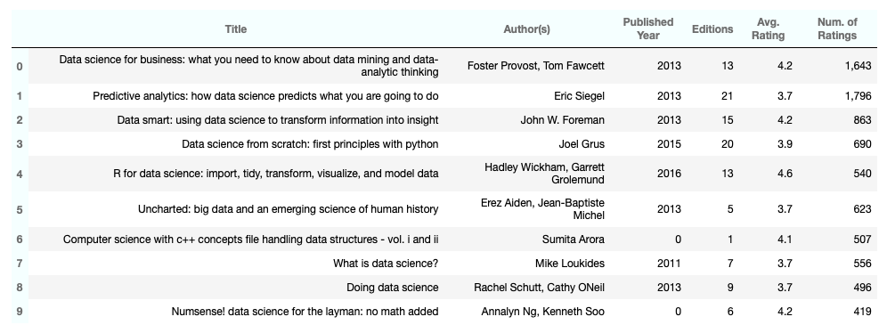

# Data Science Books Recommendation

## Web Scraping and EDA Project

#### 1 Introduction

     1.1 Project Goal
     1.2 Tools
     1.3 Web Scraping
     1.4 Features
    
#### 2 Exploratory Analysis
    
    2.1 Pre-Processing
    2.2 Inspecting Features
    2.3 Exploring Authors
    2.4 Most Rated and Most Popular Books

#### 3 Most Recommended Books

    3.1 Top 10 Most Recommended Books in Data Science
    3.2 Getting Books From The Recommended List

#### 4 Takeaways

# 1 Introduction

### 1.1 Project Goal

This was my first project with Web Scraping. Therefore, the main goal was to learn  and practice how to extract Data from websites and perform exploratory analysis.

I chose this topic because I was very interested in Data Science books and wanted to make a good recommendation list for aspiring Data Scientists.

### 1.2 Tools

* Python 3.7
* BeautifulSoap
* Pandas
* Matplotlib
* Seaborn

### 1.3 Web Scraping

The data was extracted from the website Goodreads, using BeautifulSoap. Goodreads is one of the world’s most influential reading sites, providing a platform for people interested in talking about books.

I scraped 50 webpages containing books about Data Science and created a data set with 995 entries, using Pandas.

The source code can be found <a href='scraping_books.py'>HERE!</a>

### 1.4 Features

* Title 
* Author(s)
* Avg. Rating (average rating) 
* Num. of Ratings (total number of ratings) 
* Editions (total number of editions)
* Published Year  
 
  
 
 **Most Recommended Books in Data Science Based on Goodreads Reviews**  

**Check the complete study [here!](DS_books.ipynb)**

## 4 Takeaways

In summary, this project highlighted information about Data Science books based on reviews from Goodreads, including:

* Authors who wrote most books and the most popular ones;
* Most rated and most popular books (based on the average rating and total number of ratings);
* A list of the most recommended books (based on the weighted number of ratings);
* A list with the top 10 most recommended books, prices, and links to purchase them.

Upon inspection of all features I found a moderate linear correlation between Editions (total number of editions) and Num. of Ratings (total number of ratings). However, it was not possible to correlate other features. Even though this was not the project's goal, I'm interested in keep exploring these features.
A few things I have in mind are:

* Get more features from the website (such as number of pages and number of written reviews);
* Separate the Data in categories (low and high ratings), so I can remove outliers, study the relationship of the features of each category, and develop a model to predict whether a book is highly recommended.

For now, I am happy with the obtained results, since the main purpose of this study was to practice web scraping and exploratory data analysis.

Besides, I now have a good book list to start exploring and hope this can help others as well.
